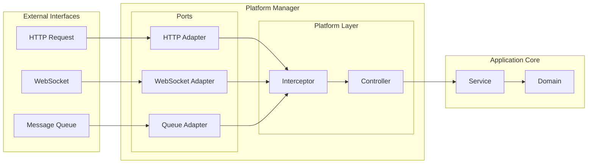

# Transportex


a platform manager that provide a unified platform for handling HTTP, queue-based / request-response microservices, and WebSocket communications

## Overview 
This project aims to provide a unified platform for handling HTTP, queue-based microservices, and WebSocket communications. By applying hexagonal architecture, controllers can remain agnostic about the data source, ensuring they receive data consistently whether it comes from HTTP, a queue, or a microservice.

The platform manager abstracts away the complexities of different communication protocols and their implementations. Whether you're using Express.js, Fastify, or any other HTTP framework, you can focus on defining your routes and handling business logic without worrying about platform-specific details like JSON parsing, file handling, or request processing.

## Background
During development, it became clear that many communication patterns (HTTP, WebSockets, queues) share similar logic. Instead of managing separate implementations for Express, Fastify, Socket.IO, RabbitMQ, etc., this project centralizes these concerns, allowing developers to focus on delivering features rather than dealing with platform-specific details.

### Key Benefits

#### Platform Independence
- **Framework Agnostic**: Switch between different platforms (Express/Fastify for HTTP, Socket.IO/WebSocket for real-time, RabbitMQ/Kafka for queues) without changing your application code
- **Infinite Scalability**: Your application remains decoupled from any specific platform implementation, allowing for seamless scaling and platform changes
- **Consistent Interface**: Different platforms have different ways of handling requests, events, or messages, but our interceptors provide a unified abstraction layer

#### Simplified Development
- **Focus on Business Logic**: Define routes, event handlers, or queue consumers without worrying about platform-specific implementation details
- **Automatic Processing**: Let the platform handle JSON parsing, file uploads, request processing, event handling, and message queuing
- **Easy Platform Migration**: Change your underlying platform (HTTP server, WebSocket implementation, or message broker) without rewriting your application code

## Architecture


## Features
- **Unified Platform**: Supports HTTP, queue-based microservices, and WebSockets.
- **Hexagonal Architecture**: Ensures that controllers are decoupled from the data source, making the system more modular and testable.
- **Validation**: Implements Zod for validating HTTP request bodies, query parameters, and URL parameters. Future plans include support for class-validator and similar validation for WebSocket events.

## Installation

```bash
npm install @albasyir/platform-manager
```


## Compatibility Table
**Legends:**
- ✅ Done
- ⚠️ Experimental
- 👷🏼‍♂️ In Development

### HTTP Protocol
| Implementation | Status | Supported Methods |
|----------------|--------|-------------------|
| Express.js     | ⚠️     | GET, POST, PUT, DELETE, PATCH |
| Fastify        | ⚠️     | GET, POST, PUT, DELETE, PATCH |
| Elysia         | 👷🏼‍♂️  |  |

### WebSocket Protocol
| Implementation | Status |
|----------------|--------|
| Socket.IO      | 👷🏼‍♂️  |
| WebSocket (native) | 👷🏼‍♂️ |

### Microservice Protocol
| Implementation | Status |
|----------------|--------|
| RabbitMQ       | 👷🏼‍♂️  |
| Kafka          | 👷🏼‍♂️  |

## Contributing
To contribute to this project, follow these steps:

1. Clone the repository.
2. Install dependencies:
   ```bash
   npm install
   ```
3. Run the tests:
   ```bash
   npm test
   ```
4. Happy coding!

## License
This project is licensed under the MIT License - see the LICENSE file for details. 