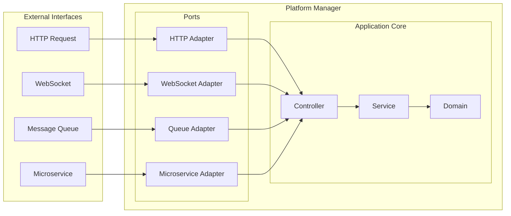

# Platform Manager

## Overview
This project aims to provide a unified platform for handling HTTP, queue-based microservices, and WebSocket communications. By applying hexagonal architecture, controllers can remain agnostic about the data source, ensuring they receive data consistently whether it comes from HTTP, a queue, or a microservice.

## Background
During development, it became clear that many communication patterns (HTTP, WebSockets, queues) share similar logic. Instead of managing separate implementations for Express, Fastify, Socket.IO, RabbitMQ, etc., this project centralizes these concerns, allowing developers to focus on delivering features rather than dealing with platform-specific details.

## Architecture


## Features
- **Unified Platform**: Supports HTTP, queue-based microservices, and WebSockets.
- **Hexagonal Architecture**: Ensures that controllers are decoupled from the data source, making the system more modular and testable.
- **Validation**: Implements Zod for validating HTTP request bodies, query parameters, and URL parameters. Future plans include support for class-validator and similar validation for WebSocket events.

## Installation

```bash
npm install @albasyir/platform-manager
```


## Compatibility Table
**Legends:**
- ✅ Done
- ⚠️ Experimental
- 👷🏼‍♂️ In Development

### HTTP Protocol
| Implementation | Status | Supported Methods |
|----------------|--------|-------------------|
| Express.js     | ⚠️     | GET, POST, PUT, DELETE, PATCH |
| Fastify        | ⚠️     | GET, POST, PUT, DELETE, PATCH |
| Elysia         | 👷🏼‍♂️  |  |

### WebSocket Protocol
| Implementation | Status |
|----------------|--------|
| Socket.IO      | 👷🏼‍♂️  |
| WebSocket (native) | 👷🏼‍♂️ |

### Microservice Protocol
| Implementation | Status |
|----------------|--------|
| RabbitMQ       | 👷🏼‍♂️  |
| Kafka          | 👷🏼‍♂️  |

## Contributing
To contribute to this project, follow these steps:

1. Clone the repository.
2. Install dependencies:
   ```bash
   npm install
   ```
3. Run the tests:
   ```bash
   npm test
   ```
4. Happy coding!

## License
This project is licensed under the MIT License - see the LICENSE file for details. 